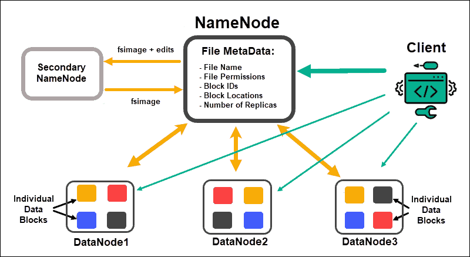
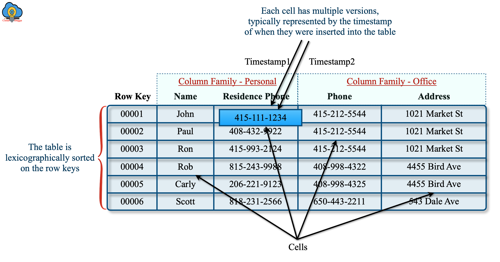

# Summary

## HDFS

HDFS is a distributed file system that handles large data sets running on commodity hardware.

Some of the features of Hadoop are:

- **Open-source** - it is free to use and modify.

- **High scalability** - it can store and process large amounts of data across clusters of commodity computers. It can scale up from a single machine to thousands of machines, each offering local computation and storage.

- **Fault tolerance** - it can handle failures of hardware or software without losing data or interrupting the processing. It does this by replicating the data across multiple nodes in the cluster and automatically recovering from failures.

- **High availability** - it can ensure that the data and the applications are always accessible and operational. It does this by using multiple copies of the data and the metadata, as well as using heartbeat messages and failover mechanisms.

- **Cost-effective** - it can reduce the cost of storing and processing large datasets by using inexpensive and widely available hardware. It also reduces the cost of development and maintenance by using a simple programming model and a common set of tools.

- **Fast** - it can perform complex computations on large datasets in parallel and in a distributed manner. It does this by using the MapReduce programming model, which divides the computation into smaller tasks and assigns them to different nodes in the cluster.

- **Data locality** - it moves the computation to the data rather than moving the data to the computation. This reduces the network traffic and improves the performance

HDFS Architecture follows a Master/Slave Architecture, where a cluster comprises of a single NameNode (Master node) and all the other nodes are DataNodes (Slave nodes).
HDFS follows Write Once – Read Many Philosophy. So, you can’t edit files already stored in HDFS. But, you can append new data by re-opening the file

**NameNode** is the master node in the HDFS Architecture that maintains and manages the blocks present on the DataNodes (slave nodes). NameNode is a very highly available server that manages the File System Namespace and controls access to files by clients.

Functions of NameNode:

- It is the master daemon that maintains and manages the DataNodes (slave nodes)
- It records the metadata of all the files stored in the cluster, e.g. The location of blocks stored, the size of the files, permissions, hierarchy, etc. There are two files associated with the metadata:
  - FsImage: It contains the complete state of the file system namespace since the start of the NameNode.
  - EditLogs: It contains all the recent modifications made to the file system with respect to the most recent FsImage.
- It records each change that takes place to the file system metadata. For example, if a file is deleted in HDFS, the NameNode will immediately record this in the EditLog.
- It regularly receives a Heartbeat and a block report from all the DataNodes in the cluster to ensure that the DataNodes are live.
- It keeps a record of all the blocks in HDFS and in which nodes these blocks are located.
- The NameNode is also responsible to take care of the replication factor of all the blocks which we will discuss in detail later in this HDFS tutorial blog.
- In case of the DataNode failure, the NameNode chooses new DataNodes for new replicas, balance disk usage and manages the communication traffic to the DataNodes.

**DataNodes** are the slave nodes in HDFS. Unlike NameNode, DataNode is a commodity hardware, that is, a non-expensive system which is not of high quality or high-availability.

Functions of DataNode:

- These are slave daemons or process which runs on each slave machine.
- The actual data is stored on DataNodes.
- The DataNodes perform the low-level read and write requests from the file system’s clients.
- They send heartbeats to the NameNode periodically to report the overall health of HDFS, by default, this frequency is set to 3 seconds.

**Secondary NameNode** works concurrently with the primary NameNode as a helper daemon. And don’t be confused about the Secondary NameNode being a backup NameNode because it is not. Secondary NameNode performs regular checkpoints in HDFS.

Functions of Secondary NameNode:

- The Secondary NameNode is one which constantly reads all the file systems and metadata from the RAM of the NameNode and writes it into the hard disk or the file system.
- It is responsible for combining the EditLogs with FsImage from the NameNode.
- It downloads the EditLogs from the NameNode at regular intervals and applies to FsImage. The new FsImage is copied back to the NameNode, which is used whenever the NameNode is started the next time.

**Blocks** are the smallest continuous location on your hard drive where data is stored. HDFS stores each file as blocks which are scattered throughout the Apache Hadoop cluster. The default size of each block is 128 MB which you can configure as per your requirement.
The blocks are also replicated to provide fault tolerance. The default replication factor is 3 which is again configurable.

## MapReduce

MapReduce is a programming model or pattern within the Hadoop framework that is used to access big data stored in the Hadoop File System (HDFS). It is a core component, integral to the functioning of the Hadoop framework.

MapReduce facilitates concurrent processing by splitting petabytes of data into smaller chunks, and processing them in parallel on Hadoop commodity servers. In the end, it aggregates all the data from multiple nodes to return a consolidated output back to the application.

## Hive

Hive is a data warehouse tool that runs on top of the Hadoop ecosystem and allows users to query and analyze large datasets using a SQL-like language called HiveQL.

Some of the features of Hive are:

- Can store data in various file formats, such as CSV, JSON, XML, Avro, Parquet, and ORC.

- Supports different compression codecs, such as Snappy, Gzip, LZO, and Brotli.

- Can also integrate with various data sources and platforms, such as relational databases, NoSQL databases, web services, or cloud services.

- Supports partition and buckets concepts for easy retrieval of data when the client executes the query.

- Supports schema evolution, which means it can handle changes in the data structure over time without losing or corrupting the data.

- Query execution is going to be like series of automatically generated map reduce jobs.

To store data in Hive, users need to create tables that define the schema and the location of the data. There are two types of tables in Hive: managed tables and external tables. **Managed tables** are controlled by Hive and their data is stored in a default location in HDFS or other compatible file systems. **External tables** are not controlled by Hive and their data is stored in a user-specified location outside of Hive. When a managed table is dropped, both the metadata and the data are deleted. When an external table is dropped, only the metadata is deleted and the data remains intact.

A new and important component of Hive i.e. **Metastore** used for storing schema information. This Metastore typically resides in a relational database.

## HBase

HBase is a distributed non-relational column-oriented database built on top of the Hadoop file system. It is an open-source project and is horizontally scalable.

HBase is a data model that is similar to Google’s big table designed to provide quick random access to huge amounts of structured data. It leverages the fault tolerance provided by the Hadoop File System (HDFS). It is a part of the Hadoop ecosystem that provides random real-time read/write access to data in the Hadoop File System.

Some of the key features of HBase are:

- **High scalability** - it scales your applications across thousands of servers because HBase applications scale linearly.

- **Fault tolerance** - data is split across many hosts in a cluster (data replication), thus the system can handle with the failure of an individual host.

- **Speed** - it comes with low-latency read and write access to huge amounts of structured, semi-structured and unstructured data. This happens by distributing the data to region servers where each of those servers stores a portion of the table’s data. This makes the data read and write faster than if all the data lived on the same server.

- **Column-oriented storage support** - it stores data in columns rather than rows. This allows for faster and more efficient retrieval of data based on column values.

- **Consistent and atomic read and write operations** - it ensures that the data is always accurate and up-to-date, and that each operation is either completed entirely or not at all.

- **Schema evolution** - it can handle changes in the data structure over time without losing or corrupting the data. It does this by storing the schema with the data or in a separate registry.

HBase uses a master-slave architecture, where one node acts as the master and controls the other nodes, which are called slaves. The master node is called the **HMaster**, which manages the metadata and coordinates the access to data. The slave nodes are called **Region Servers**, which store and serve the data blocks. HBase splits the tables into smaller subregions called regions, which are distributed across the RegionServers. Each region is assigned to one RegionServer at a time, but can be moved or split as needed.

HBase also uses **ZooKeeper**, which is a service that maintains the configuration and coordination information for the cluster.

HBase is a column-oriented database and the tables in it are sorted by row. The table schema defines only **column families**, which are the key value pairs. A table have multiple column families and each column family can have any number of columns. Subsequent column values are stored contiguously on the disk. Each cell value of the table has a timestamp. In short, in an HBase:

- Table is a collection of rows.
- Row is a collection of column families.
- Column family is a collection of columns.
- Column is a collection of key value pairs.

## Spark

Spark is a framework for distributed data processing that runs on clusters of computers. It can handle large amounts of data in parallel and in memory, making it fast and efficient for various applications. Spark has four main components: Spark Core, Spark SQL, Spark Streaming, and Spark MLlib.

**Spark Core** is the base engine that provides the basic functionality of Spark, such as task scheduling, memory management, fault recovery, and distributed storage. It also defines the main abstraction of Spark, which is the Resilient Distributed Dataset (RDD). An RDD is a collection of data elements that can be partitioned across multiple nodes and operated on in parallel.

**Spark SQL** is a component that allows users to query structured or semi-structured data using SQL or a DataFrame API. A DataFrame is a distributed collection of data organized into named columns, similar to a table in a relational database. Spark SQL can also integrate with various data sources and formats, such as Hive, Parquet, JSON, and JDBC.

**Spark Streaming** is a component that enables users to process and analyze real-time data streams from various sources, such as Kafka, Flume, Twitter, or TCP sockets. It can also apply transformations and actions on the streaming data, such as filtering, aggregating, joining, or updating state. Spark Streaming uses a micro-batch approach, which means it divides the streaming data into small batches and processes them using the Spark engine.

Spark follows a **master-slave architecture**, where one node acts as the master and controls the other nodes, which are called slaves. **The master node is called the driver program**, which creates a SparkContext object to coordinate the execution of the application. The slave nodes are called **worker nodes or executors**, which run the tasks assigned by the driver program and store the data in memory or disk. Spark also relies on a cluster manager to allocate resources across applications. There are different types of cluster managers that Spark can work with, such as Standalone, YARN, Mesos, or Kubernetes.

**RDD, DataFrame, and Dataset** are three different abstractions for working with data in Apache Spark. They have some similarities and differences that are important to understand. Here is a summary of their distinctions:

- **RDD** stands for Resilient Distributed Dataset, which is the basic and low-level API for data processing in Spark. It represents a distributed collection of elements without any schema, meaning that the data can be of any type and structure. RDDs provide more control over the data but with lower-level optimizations. RDDs are best suited for unstructured or semi-structured data, such as text files, logs, or JSON.

- **DataFrame** is a higher-level API that is optimized for performance and ease of use. It represents a distributed collection of data organized into named columns, similar to a table in a relational database or a spreadsheet. DataFrames have a schema, which defines the types and names of the columns, and each row represents a single record or observation. DataFrames can handle structured or semi-structured data, such as CSV, JSON, XML, Parquet, or Hive tables.

- **Dataset** is an extension of DataFrame with more features, such as type-safety and object-oriented interface. It combines the benefits of RDDs and DataFrames by allowing users to work with both unstructured and structured data using domain-specific objects. Datasets also support various operations and transformations, such as filtering, aggregating, joining, and grouping data

## YARN

Apache Hadoop YARN is the resource management and job scheduling technology in the open source Hadoop distributed processing framework. One of Apache Hadoop's core components, YARN is responsible for allocating system resources to the various applications running in a Hadoop cluster and scheduling tasks to be executed on different cluster nodes

The fundamental idea of YARN is to split up the functionalities of resource management and job scheduling/monitoring into separate daemons. The idea is to have a global ResourceManager (RM) and per-application ApplicationMaster (AM). An application is either a single job or a DAG of jobs.

**The Resource Manager** and the **Node Manager** form the data-computation framework. The ResourceManager is the ultimate authority that arbitrates resources among all the applications in the system. The NodeManager is the per-machine framework agent who is responsible for containers, monitoring their resource usage (cpu, memory, disk, network) and reporting the same to the ResourceManager/Scheduler.

**The Resource Manager** has two main components: **Scheduler** and **Applications Manager**.

**The Scheduler** is responsible for allocating resources to the various running applications subject to familiar constraints of capacities, queues etc. The Scheduler is pure scheduler in the sense that it performs no monitoring or tracking of status for the application. Also, it offers no guarantees about restarting failed tasks either due to application failure or hardware failures.

**The Applications Manager** is responsible for accepting job-submissions, negotiating the first container for executing the application specific **Application Master** and provides the service for restarting the ApplicationMaster container on failure. The per-application ApplicationMaster has the responsibility of negotiating appropriate resource containers from the Scheduler, tracking their status and monitoring for progress.

## Data Formats

| | CSV | JSON | XML | Avro | Parquet | ORC |
| --- | --- | --- | --- | --- | --- | --- |
| Structure | Tabular, flat, comma-separated values | Key-value pairs, supports nested objects and arrays | Hierarchical, tree-like structure with tags and attributes | Binary format with schema embedded in the file | Binary format with columnar storage and schema embedded in the | Binary format with columnar storage and schema embedded in the file |
| Binary | No | No | No | Yes | Yes | Yes |
| Human-readable | Yes | Yes | Yes | No | No | No |
| Metadata  | No native support, can be added externally using extensions such as CSVY or CSVW | No native support, can be added externally using extensions such as JSON-LD or GeoJSON | Supports metadata using attributes or elements within the XML document | Supports metadata by storing the schema with the data or in a separate registry | Supports metadata by storing the schema with the data or in a separate registry | Supports metadata by storing the schema with the data or in a separate registry |
| Compression  | No native support, can be compressed externally using gzip or zip | No native support, can be compressed externally using gzip or zip | No native support, can be compressed externally using gzip or zip  | Supports various compression codecs such as Snappy, Deflate, Bzip2, Zstandard | Supports various compression codecs such as Snappy, Gzip, LZO, Brotli | Supports various compression codecs such as Snappy, Zlib, LZO |
| Splitability    | No  |  No  |  No  |  Yes  |  Yes |  Yes|
| Supports complex data structures  | No  |  Yes  |  Yes  |  Yes  |  Yes |  Yes|
| Schema evolution support    | No  |  No  |  No  | Yes  |  Partially |    Partially |
| Predicate and projection pushdown support    | No  |  No  |  No   | No   | Yes|   Yes|
| Pros    | Simple and lightweight. Widely supported | Language-independent and interoperable. Widely used in web APIs |  Self-describing and extensible. Widely used in web services| Compact and fast. Schema evolution support | Compact and fast. Efficient for analytical queries with predicate and projection pushdown support| Compact and fast. Efficient for analytical queries with predicate and projection pushdown support|
| Cons | No standard schema. No complex data types or nested structures. Inefficient for large datasets| Verbose and inefficient for large datasets. Not ideal for binary data.| Verbose and inefficient for large datasets. Not ideal for binary data. Requires parsing libraries.| Not ideal for streaming data.| Not ideal for streaming data or frequent updates| Not ideal for streaming data or frequent updates|
| Use Cases    | Simple, flat data structures and smaller datasets where human readability is crucial    | Data interchange between web applications and APIs, especially when dealing with complex data structures    | Data interchange between web services and applications, especially when dealing with hierarchical data structures    | Data serialization and storage in Hadoop ecosystem, especially when dealing with evolving schemas    | Data analysis and processing in Hadoop ecosystem, especially when dealing with large datasets and analytical queries    | Data analysis and processing in Hadoop ecosystem, especially when dealing with large datasets and analytical queries|

